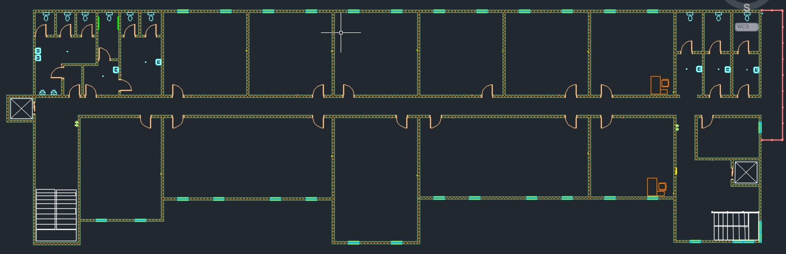
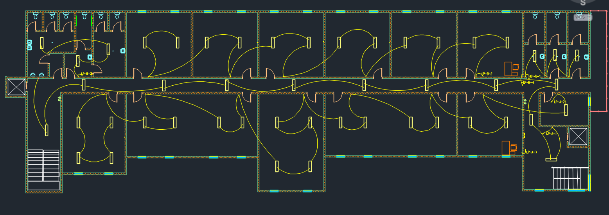
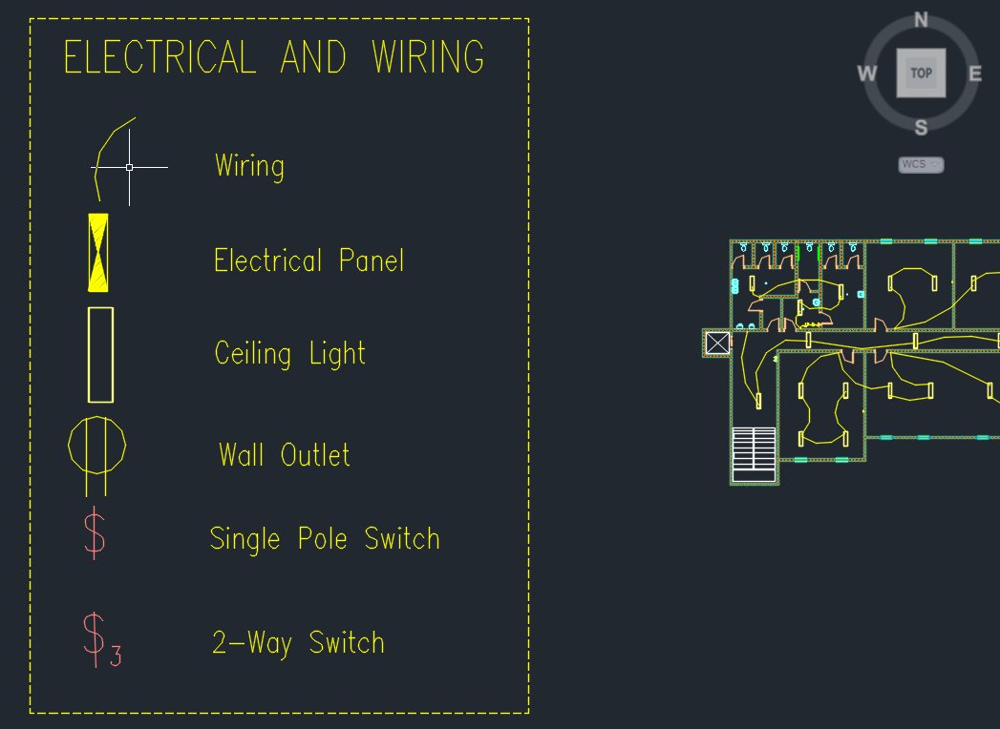
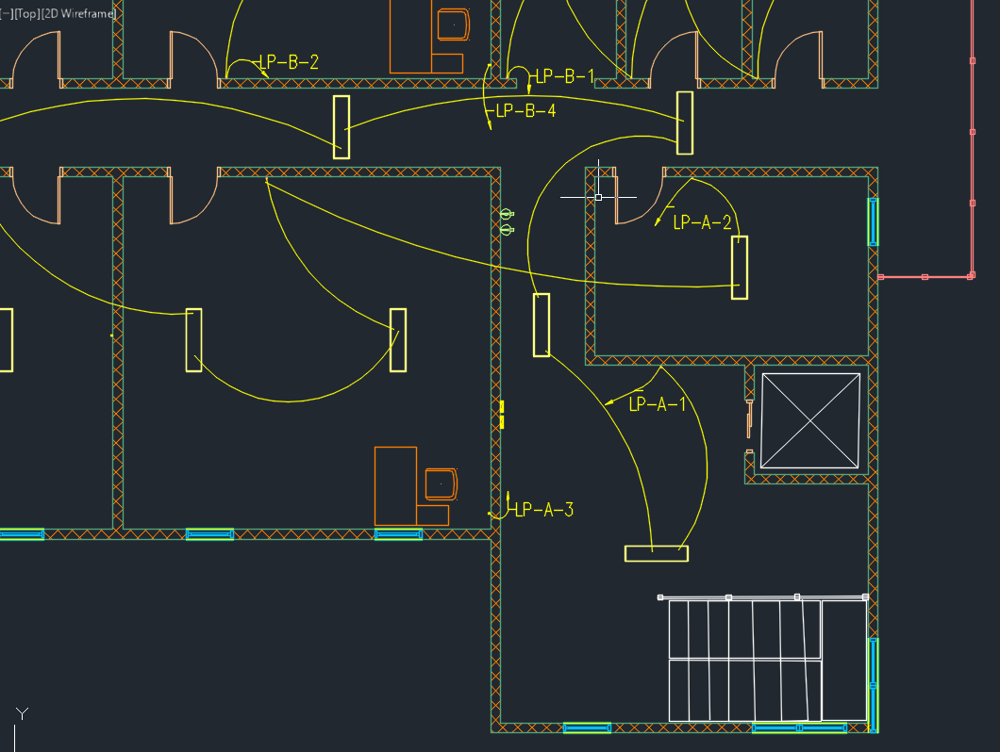
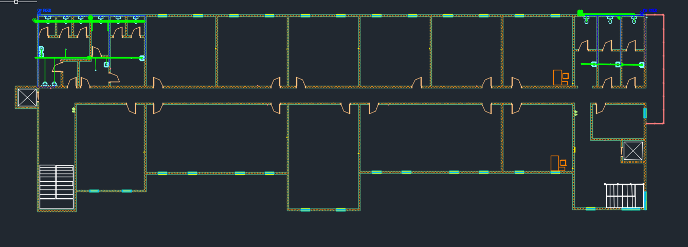
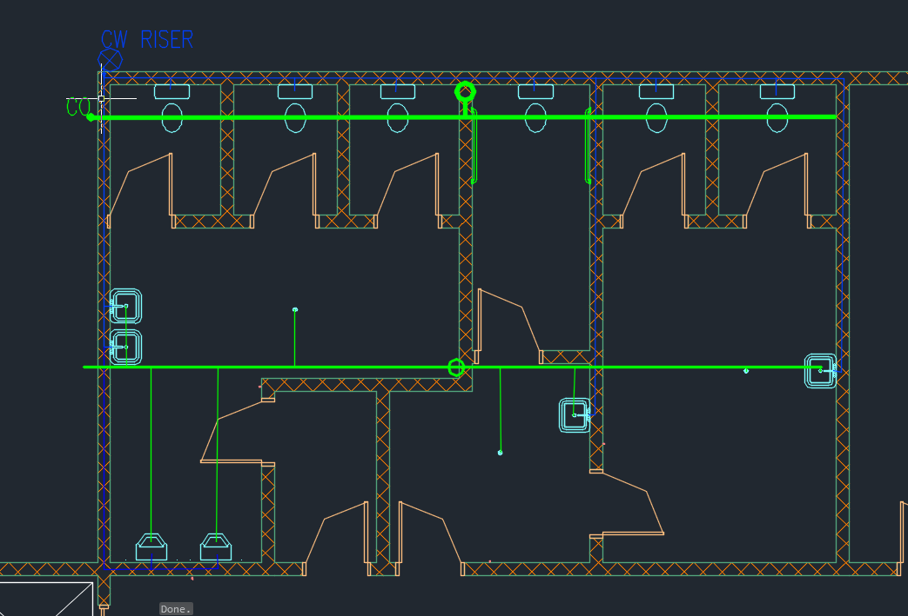
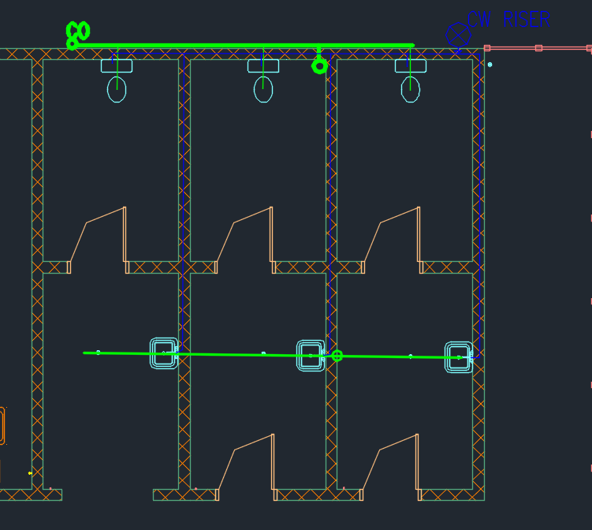
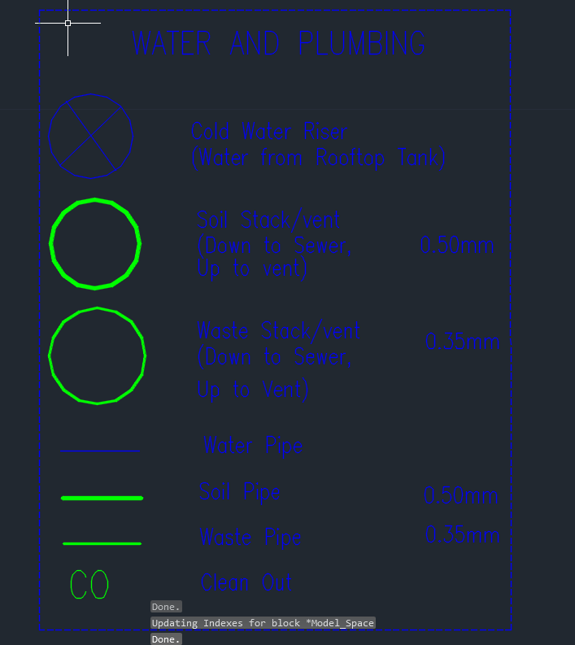
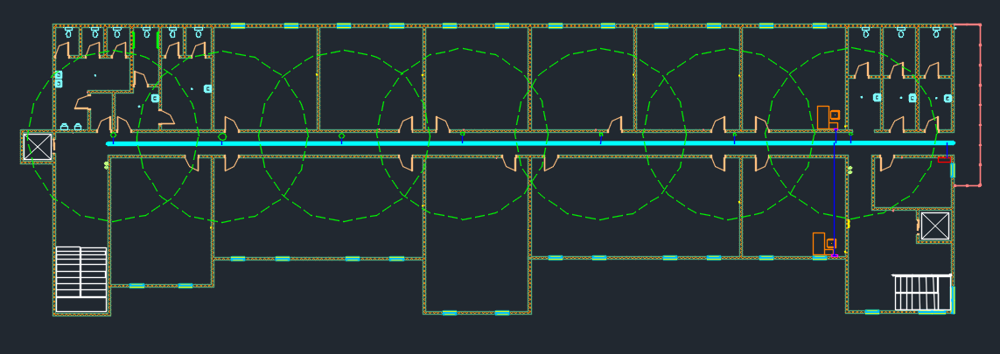
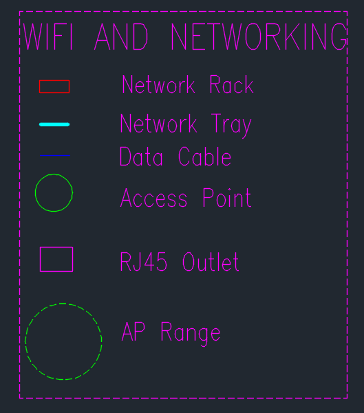

# BSCCS/2024/32659 — Computer Graphics CAT

**Practical Computer Graphics — Continuous Assessment Test**

---

## Student Details

| Field | Details |
|-------|---------|
| **Admission No.** | BSCCS/2024/32659 |
| **Program** | BSc Computer Science |
| **Unit** | Practical Computer Graphics |
| **Task** | CAT — 14-Floor Commercial Building Design |

---

## Project Overview

Design and technical drawings for a **14-floor commercial building (CT Tower)** created using AutoCAD. The submission covers all required architectural and systems planning components.

---

## Submission Files

| File | Description |
|------|-------------|
| `BSCCS_2024_32659_COMPUTERGRAPHICS_CAT.dwg` | Main AutoCAD editable drawing file |
| `FloorPlan.PNG` | Typical floor plan layout |
| `ElectricalPlan.PNG` | Full electrical wiring layout |
| `ElecricalPlanKey.PNG` | Electrical plan legend/key |
| `ElecricalPlanPanelBox.PNG` | Distribution panel box detail |
| `PlumbingPlan.PNG` | Water supply and plumbing plan |
| `PlumbingPlanKey.PNG` | Plumbing symbols legend |
| `PlumbingPlanLeft.PNG` | Plumbing plan — left section |
| `PlumbingPlanRight.PNG` | Plumbing plan — right section |
| `WIFIPlan.PNG` | Wi-Fi and network cabling plan |
| `WIFIPlanKey2.PNG` | Network plan legend/key |

---

## Drawing Components

### (a) Building Floor Plan — 10 Marks
Typical floor plan for one floor of the 14-storey building showing:
- Walls, doors, windows, staircases, and elevator shafts
- Room layout: offices, corridors, and washrooms
- Correct use of layers and line types
- Clear dimensions and labels

---

### (b) Electrical Wiring Layout — 6 Marks
Electrical plan for the building showing:
- Main power supply line
- Distribution panels and circuit breakers
- Lighting points and socket outlets
- Switch positions
- Electrical symbols and legend

| Legend | Panel Box |
|--------|-----------|
|  |  |

---

### (c) Water Supply and Plumbing Plan — 6 Marks
Plumbing system drawing indicating:
- Main water inlet
- Vertical risers and horizontal distribution pipes
- Washroom connections
- Water tanks / pump rooms
- Correct plumbing symbols and pipe routing

| Left Section | Right Section | Legend |
|-------------|--------------|--------|
|  |  |  |

---

### (d) Wi-Fi and Network Cabling Plan — 5 Marks
Network infrastructure layout showing:
- Network backbone
- Distribution switches per floor
- Wi-Fi access point locations
- Data cabling routes
- Proper labeling and symbols

### (e) Presentation and Professionalism — 3 Marks
- Proper use of layers and naming conventions
- Drawing organization and neatness
- Clear legends, titles, and scale indicators
- Correct file submission format

---

## Tools Used

- **AutoCAD** — Primary design and drafting tool
- **Git / GitHub** — Version control and submission

---

## How to Open

1. Open AutoCAD (2018 or later recommended)
2. File → Open → `BSCCS_2024_32659_COMPUTERGRAPHICS_CAT.dwg`
